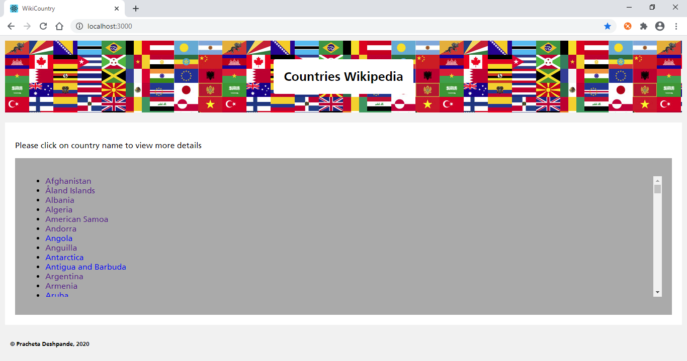
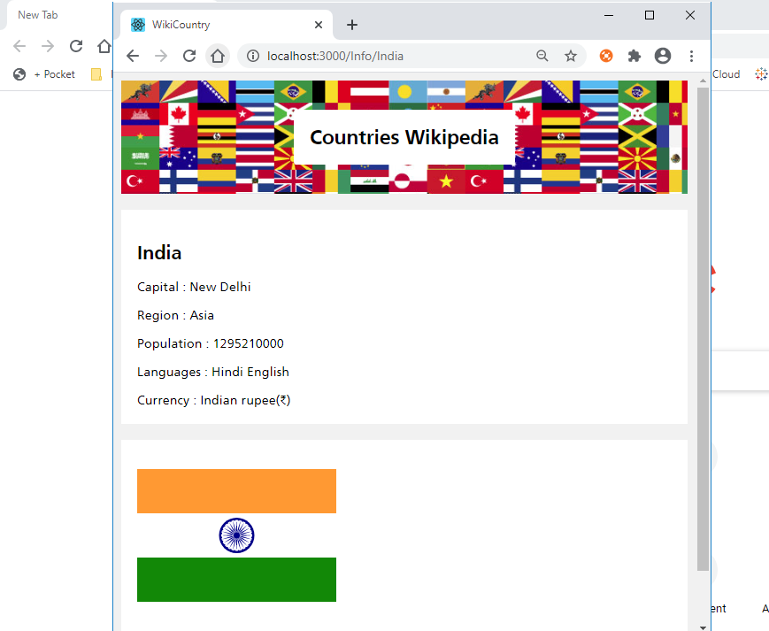

# Countries-Wikipedia

## About 

Welcome to the Countries-Wikipedia portal

You can find list of countries and view details of each country like Capital, Flag img, Population, Language, Currency

Please find screenshots - 

## How to install

Download/Clone the project and run following-
> cd app/ui

> npm install

## Project Structure

The website follows a Microservices architecture

The app is divided into UI and Services(In this case Services is already built(public API) and details are mentioned below ).

The components folder under ui contains the major flow.

UI is divided into Header Footer and Body layer.

The API is hit from Header class once and is passed down to CountryList and CountryDetails page via props.

Routing is enabled with Routes being / or /Info/country-name
  
We also have an Error Boundary class which handles runtime errors

style.css covers styling for all pages  

There is also .env file which is like a config file for the ui side

## Source of data - 
The source data is loaded asynchronously using axios from Public API Website :  https://restcountries.eu/ 

REST Endpoint : https://restcountries.eu/rest/v2/all

Output : 

## Note

While loading data you would see a Spinning wheel like below - 

In case of runtime error, you would see -

There is a feature for responsiveness of the website as well-

Caution is also taken to display logs in just dev environment only, not prod 

Dev-

Prod-

